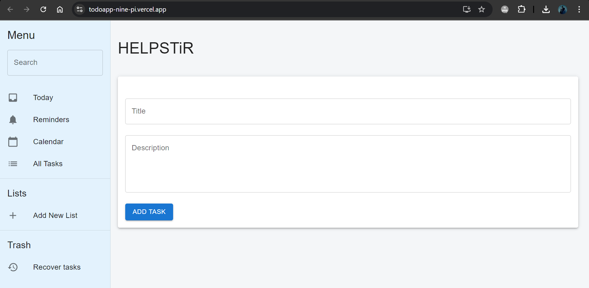
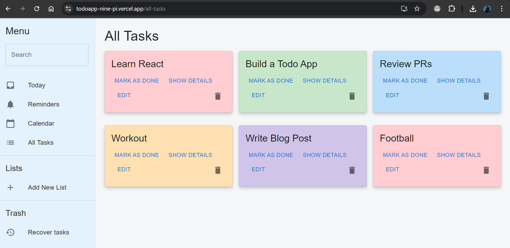
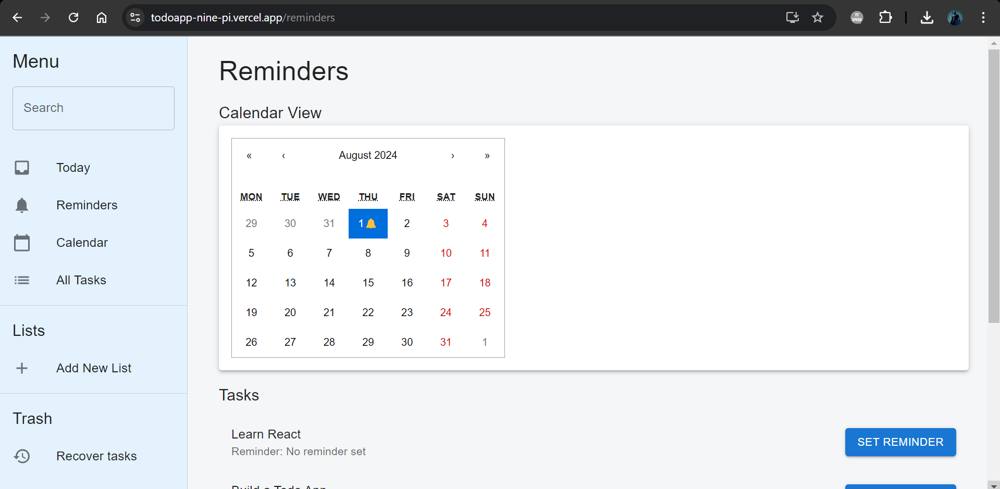

# To-Do List Application

This is a To-Do List application built with React and Material-UI. The app allows users to create, update, mark as done, and delete tasks. It also features a search functionality to filter tasks and displays tasks in an expandable list format with colorful cards.

## Insights of todoapp







## Features

### Core Features
- **Create Task**: Users can add new tasks.
- **Update Task**: Users can edit existing tasks.
- **Mark as Done**: Users can mark tasks as completed.
- **Delete Task**: Users can delete tasks.
- **Search Tasks**: Implemented a search functionality to filter tasks.
- **Expandable List**: Displays tasks in an expandable list format, showing a description and a timestamp of the last update when expanded.

### Additional Features
- **Data Storage**: Uses a dummy JSON file as a data repository.
- **Animations**: Includes animations for task addition and expansion.
- **Colorful Cards**: Tasks are displayed as colorful cards for better visual appeal.
- **URL Parameters**: Utilizes URL parameters to handle search functionality.

## Tools and Technologies

### Frontend
- **React**: A JavaScript library for building user interfaces.
- **Material-UI**: A popular React UI framework.
- **React Router**: For handling URL parameters and routing.
- **axios**: For making HTTP requests.

### Styling
- **Material-UI**: Provides a set of React components that implement Google's Material Design.

## System Design

### Components
- **TaskForm**: Handles task creation and updating.
- **TaskItem**: Displays individual tasks.
- **TaskList**: Displays the list of tasks.
- **Sidebar**: Contains the search bar and navigation options.
- **CreateTask**: Main page displaying the form and task list.

### State Management
- State is managed using React hooks (`useState`, `useEffect`).
- Tasks are managed with a custom hook `useTasks` which provides functions to add, update, toggle completion, and delete tasks.

### Data Handling
- Initial tasks are loaded from a JSON file (`data.json`).
- Tasks are filtered based on the search query entered by the user.

## Getting Started

Runs the app in the development mode.\
Open [https://todoapp-nine-pi.vercel.app/](https://todoapp-nine-pi.vercel.app/) to view it in the browser.

### Prerequisites
- Node.js and npm installed on your machine.

### Installation
1. Clone the repository:
    ```sh
    git clone https://github.com/moto23/todoapp.git
    cd todoapp
    ```

2. Install the dependencies:
    ```sh
    npm install
    ```

3. Start the development server:
    ```sh
    npm start
    ```

The app should now be running on `http://localhost:3000`.

### Usage
- To add a task, fill in the title and description in the form on the homepage and click "Add Task".
- To update a task, click the edit icon on the task card and modify the details.
- To mark a task as done, click the checkbox on the task card.
- To delete a task, click the delete icon on the task card.
- Use the search bar in the sidebar to filter tasks by title.


## Contributing
Contributions are welcome! Please open an issue or submit a pull request for any changes.

## License
This project is licensed under the MIT License.

